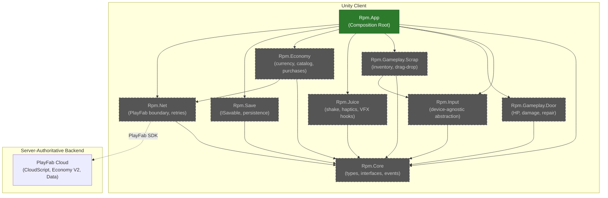
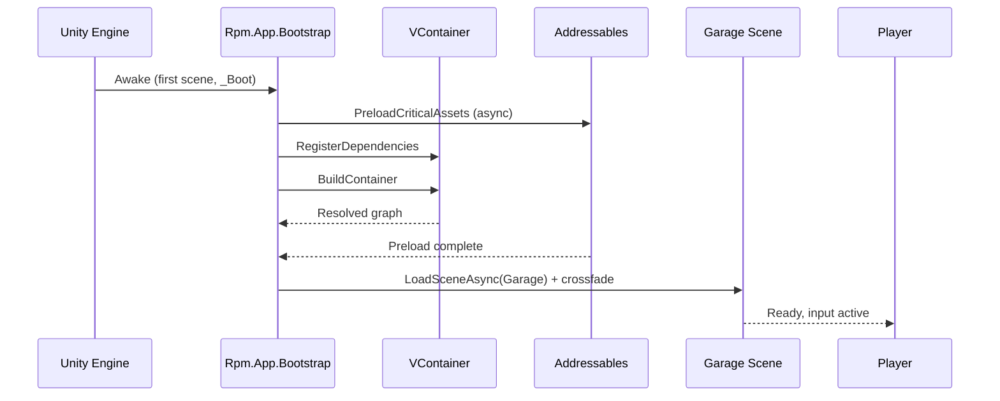
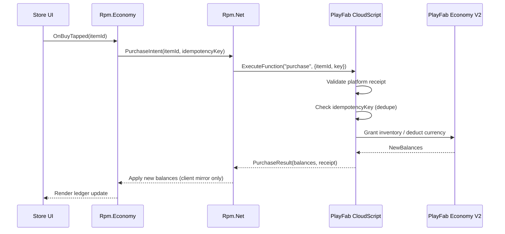
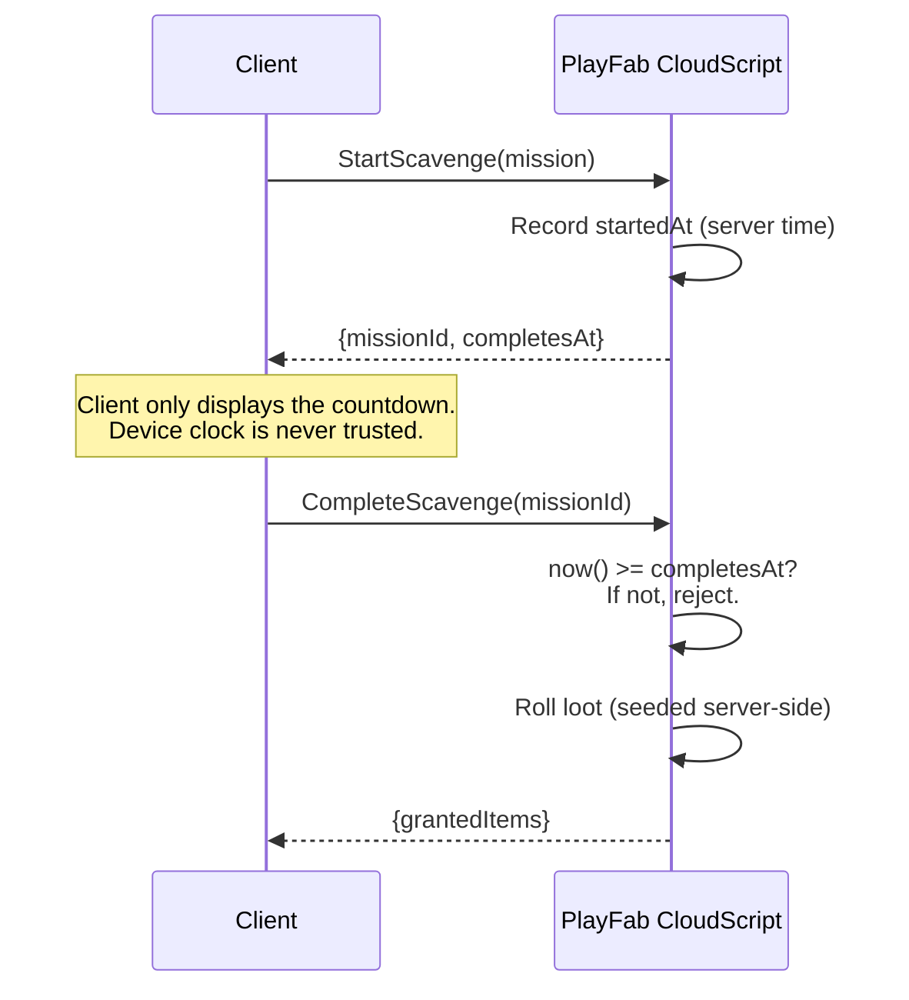

# System Architecture v0.1

**Maintainer:** Kendra Brooks (`performance-hardener`)
**Last reviewed:** 2026-04-17
**Status:** Living document — this file IS the current state. Changes require an ADR.

> **Note:** This is v0.1, authored at Sprint 0 scaffold time. Many modules described below are **aspirational** (planned, not yet in the codebase). Flag: `🚧` marks aspirational components.

---

## 1. Context & Constraints

- **Target platforms:** iOS · Android · Steam (Windows/macOS/Linux/Deck) · PlayStation 5 · Xbox Series X|S
- **Engine:** Unity **6000.0.73f1** LTS · URP (bumped from `6000.0.32f1` on 2026-04-17 per [ADR-002](adr/ADR-002-unity-version-policy.md) after Unity Hub flagged `6000.0.32f1` for a known security issue)
- **Perf mandate:** **60 FPS locked** on baseline devices (iPhone 12, Pixel 6, Steam Deck)
- **Input latency budget:** **<12ms p95** (RPM-008 gate)
- **Team scale:** 10 agents + Owner
- **Third-party SDKs:** PlayFab (backend), VContainer (DI), UniTask (async), Addressables (content), game-ci (CI runners)

---

## 2. Module Map

Target module layout once Sprint 1 Kinetic Door work lands. Each top-level module becomes its own Unity Assembly Definition (`.asmdef`). Circular references are a PR blocker.

**Legend:** solid green = exists as of commit `4b5590f`; dashed = aspirational (lands during Sprint 1–3).

### Module Responsibilities

| Assembly | Status | Depends on | Responsibility |
|---|---|---|---|
| `Rpm.App` | 🚧 | all | Composition root, VContainer setup, scene bootstrap |
| `Rpm.Core` | 🚧 | — | Public types, interfaces, event definitions |
| `Rpm.Input` | 🚧 | Core, Unity.InputSystem | Touch/gamepad/KB+M contracts; haptic profiles |
| `Rpm.Gameplay.Door` | 🚧 | Core | Door HP state, damage events, visual-ruin-state machine |
| `Rpm.Gameplay.Scrap` | 🚧 | Core, Input | Scrap inventory, drag-drop, snap-to-damage-point |
| `Rpm.Juice` | 🚧 | Core | Screen shake, haptic curves, VFX Graph drivers |
| `Rpm.Economy` | 🚧 | Core, Net | Client-side ledger, store presentation; **never** authoritative |
| `Rpm.Save` | 🚧 | Core | `ISavable`, versioning, migration |
| `Rpm.Net` | 🚧 | Core | PlayFab client boundary, idempotency, retry/backoff |
| `Rpm` (root) | ✅ | Unity.InputSystem, UniTask, VContainer | Placeholder flat assembly — will be split Sprint 1 |

---

## 3. Runtime Composition

The app boots through a single composition root (`Rpm.App.Bootstrap`) that wires the DI container before any gameplay scene loads.

**Lifetime rules:**
- `Singleton`: services (Save, Net, Economy facade, JuiceBus)
- `Scoped`: per-scene (DoorController, ScrapController, InputRouter)
- `Transient`: value types and short-lived handlers

---

## 4. Client ↔ Server Contract

**Golden rule:** the client is the **view**. The server is the **truth**. Any mutation that affects economy, progression, or competitive fairness goes through PlayFab CloudScript.

### Economy Purchase (canonical example)

### Scavenge Timer (server clock authority)

### Authoritative Boundaries (summary)

| Action | Client role | Server role |
|---|---|---|
| Damage door | Visual only | — |
| Repair door | Visual only | — |
| Wave progression | Local-replay safe | — |
| Scavenge timer | Display countdown | Authoritative start/end |
| Gacha pull | Request only | RNG, pity counter, drop table |
| Purchase | Intent only | Validate receipt, grant |
| Currency mutation | Display mirror | Apply |
| Save blob | Intent only | Versioned write |

---

## 5. Cross-cutting Concerns

| Concern | Approach | Notes |
|---|---|---|
| Logging | Unity.Logging with per-module log levels | Strip `Verbose` from release builds; PII-scrub at sink |
| Telemetry | PlayFab WriteEvents + dedicated custom dashboards | Dev title pending license-complete |
| Error handling | Composition-root exception boundary + per-feature degrade-gracefully | Never show raw exceptions to players |
| Feature flags | `ScriptableObject` (local) → override from PlayFab `TitleData` (server) | Kill-switches required for every IAP feature |
| Secrets | GitHub Actions only; never in-repo — see [SECRETS.md](../../SECRETS.md) | |
| Save format | Versioned blob; server-side migration on load | Version bump requires migration tests |

---

## 6. Accepted ADRs

None yet. First ADRs expected during Sprint 1:

| ADR | Title | Expected sprint |
|---|---|---|
| ADR-001 | VContainer as the DI container (over Zenject) | Sprint 1 |
| ADR-002 | PlayFab Economy V2 as sole economy source | Sprint 1 |
| ADR-003 | Addressables over StreamingAssets for all deliverable content | Sprint 1 |
| ADR-004 | Input System (Unity) with device-agnostic action maps | Sprint 1 |

When an ADR lands, it gets a file in `docs/architecture/adr/ADR-NNN-slug.md` and is appended to this table.

---

## 7. Open Questions (Future ADRs Likely)

- **Shader variant strategy** — separate `.shadergraph` per platform or use keywords + stripping?
- **Save serialization format** — JSON (human-readable) vs. Protobuf (compact)?
- **Offline-first playability** — which features work with zero connectivity, which require online?
- **Hot-reload economy config** — can we change prices / drop tables without a client update via PlayFab TitleData alone?
- **Anti-cheat layering** — where does client-side tamper detection end and server validation begin?

---

## 8. Amendments

| Version | Date | Change | Approved by |
|---|---|---|---|
| 0.1 | 2026-04-17 | Initial architecture sketch — module plan, runtime composition, client↔server contract, first ADR pipeline | Owner (accepted pending Sprint 1 first ADR) |
