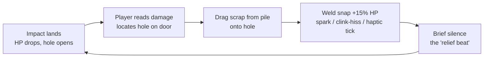
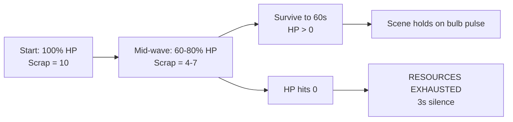

# [DESIGN-001] Garage View — Sprint 1 Night Defense Slice

**Author:** Simone Carver (`atmosphere-architect`)
**Date:** 2026-04-17
**Linked Feature:** [FEAT-001 Kinetic Door](../../../tickets/FEAT-001-kinetic-door.md)
**Linked Story:** [RPM-001 Drag-to-Repair Core Loop](../../../tickets/RPM-001.md)
**Status:** Draft

---

## Player Fantasy

You are the last grease-monkey on a dead highway, barricaded inside your own workshop with a half-built car you call *The Beast*. You have not seen sunrise in weeks. The world outside the shutter is a rhythm of fists and jawbones on corrugated steel, and that rhythm is getting louder. Tonight is not about escape. Tonight is about the **door holding until dawn**. You have scrap, a welder's instinct, and a single sodium-vapor bulb between you and whatever is out there. Every seal you slam into a fresh hole is a heartbeat you bought yourself.

> **Fantasy sentence (the one we defend):**
> *"I am the only thing keeping this door closed, and every piece of scrap I weld is a second of my own life bought back from the dark."*

---

## Core Loop



1. **Threat** — rhythmic impact every 1.5s chews 5% HP off the door and spawns a visual wound (damage decal) at a randomized coord.
2. **Read** — the player scans the door, locates the fresh hole, and confirms scrap is in inventory.
3. **Act** — player drags a scrap unit from the bottom-left pile onto the hole's damage-point hitbox.
4. **Release** — weld snap, spark flash, HP restored by +15%, dust settles. A breath.
5. **Return** — the next impact is already cocking back. Loop.

The loop's job is to make the player **miss silence**. The quiet after a successful weld is the drug.

---

## Moment-to-Moment

The first 60 seconds of the Sprint 1 build, beat by beat. This is the exact slice Jasmine will QA and Jalen will clip for the hook reel.

| Time | What the player sees | What the player hears | What the player does |
|---|---|---|---|
| 0:00 | Fade from black. Sodium-vapor bulb humming, steady amber cast. Door centered, clean, 100% HP. Scrap pile bottom-left (10 units). HP ring top-right, full. | Low room tone. Distant CB-radio static, no voice. Bulb's 60Hz hum. | Nothing. Read the room. |
| 0:02 | Taped polaroids flicker into readability on the workbench as the bulb settles — a woman, a dog, a sunrise. Two door tally-marks already scratched in. | Faint wind whistle through the shutter's bottom seal. | Eyes track the polaroids. First diegetic story beat. |
| 0:05 | **First impact.** Door flexes 4 pixels inward. Dust falls from rafters in a vertical ribbon. Screen shake: magnitude 0.15. One damage decal blooms at mid-door. HP → 95%. | `SFX_Metal_Impact` (pitch 1.0). Dust particle hiss. Short bulb flicker tick. | Adrenaline spike. Locates the hole. |
| 0:06 | Damage decal holds a faint red edge pulse at 0.8Hz — "repair me" affordance. | CB static dips briefly, comes back. | Starts drag from scrap pile. |
| 0:08 | Scrap sprite trails the finger/cursor with a 1-frame lag ghost. Hole highlight brightens as the drag enters its hitbox. | Metal-on-concrete scrape under the drag (loop, volume-rides on drag velocity). | Drag scrap onto hole. |
| 0:09 | Weld snap. Spark VFX burst (<8 particles, single SRP pass). Damage decal replaced by scrap-patch sprite. HP → 100%. Screen shake: magnitude 0.05, outward-elastic. Bulb steadies. | `SFX_Scrap_Weld` (clink-hiss), haptic tick (Light Impact). | Releases. A breath. **Relief beat.** |
| 0:10–0:11 | Silence. Bulb hum returns. Dust motes drift. | Silence except hum + CB static. **This negative space sells the next impact.** | Nothing. Intended dwell. |
| 0:12 | Next impact. HP → 95%. New hole, different coord. | `SFX_Metal_Impact` (pitch 0.93). | Reads, drags, welds. |
| 0:13–0:59 | Loop continues. Impact cadence is flat 1.5s — **no escalation Sprint 1**. Player survives if HP > 0 at 0:60. | Consistent. No stinger layer yet (Sprint 2 owns waveform escalation). | Repeats the loop. |
| 1:00 | Bulb pulses green once. HP ring halo settles. Scene ends on a hold. | One soft CB-radio blip — "…mornin' again, partner…" then static. | Exhale. The demo is the hook. |

**Dwell targets:**
- Impact → player first gesture: **≤ 0.8s** (if longer, tension leaks).
- Drag → weld release: **≤ 1.2s** (test via Jasmine's instrumented replay).
- Post-weld silence: **1.0–1.5s** before next impact (this is the relief window).

---

## Progression

**Sprint 1 = one wave. 60 seconds. Flat cadence. No escalation.**

The only "progression" this sprint is the HP curve inside the single wave:



**Deferred progression work (not this sprint):**
- *Multi-wave escalation curve* — **deferred to Sprint 2** (RPM-002 Impact Event Cadence).
- *Tally-scratch increment on survival* — **deferred to Sprint 2** (needs save-state plumbing from RPM-007).
- *Day/Scavenge loop* — **deferred to Sprint 5+** (outside the Prototype Gate).
- *The Beast (car) reveal and escape arc* — **deferred post-Prototype Gate** (lore-only in Sprint 1).
- *Visual ruin state machine (door dents/decays stage by stage)* — **deferred to Sprint 2** (RPM-003).
- *Full weld VFX layer (shader polish, gold-leaf)* — **deferred to Sprint 3** (RPM-004).
- *Scarcity Squeeze + Ghost Refill telemetry* — **deferred to Sprint 4** (RPM-005).

---

## Failure States

### The only Sprint 1 failure: HP reaches 0

When door HP crosses 0:

1. **Freeze.** All input disabled. Last impact's screen shake damps to zero over 300ms.
2. **Silence.** Hard audio bus mute — all SFX, music, ambience, CB static — for **3.0 seconds**. The bulb stays on, dust stops falling mid-air (time-scale 0). This silence is **load-bearing**; it is the Owner's original North Star beat.
3. **Title card.** At T+3.0s the words `RESOURCES EXHAUSTED` fade in (white, serif, center-screen, no drop-shadow, no easing flourish). Hold 2 seconds.
4. **Retry affordance.** A single prompt appears beneath: *"Tap to try again"* / *"Press A"* / *"Click"*. No monetization CTA in Sprint 1 — the Ghost Refill tap-zone (RPM-005) lives **inside** the 3s silence region but is invisible and non-functional this sprint (telemetry-only, wired Sprint 4).

**What defeat feels like:** not a game-over sting. Not a punishment chord. The absence of sound is the punishment. The player hears their own breathing.

**Recovery path (Sprint 1):** reload the scene. That is the entire retry loop. No run summary, no rewards, no streak counter — those are Sprint 5+ meta concerns.

---

## Environmental Storytelling

Every diegetic element below is committed to the Sprint 1 placeholder build. All can be satisfied with placeholder sprites + simple shaders; none require final art.

| Element | What it shows | Sprint 1 implementation |
|---|---|---|
| **Taped polaroids on the workbench** | The mechanic had a life before the dark. A woman. A dog. A sunrise. Corners curled, tape yellowed. | 3 static placeholder quads on the workbench prop; readable from the default camera framing. No interaction. |
| **Door tally-scratches** | How many nights have already been survived. Sets expectation that tonight is just another night. | 2 placeholder scratch decals near the door's right edge. Count is static for Sprint 1; increment logic deferred to Sprint 2. |
| **CB-radio static loop** | Someone, somewhere, used to broadcast. Not anymore. Ghost of civilization. | Looping audio source on the workbench radio prop. 30s loop of pink-noise-modulated static with one faint, unintelligible voice blip at ~0:07 and ~1:00. |
| **Sodium-vapor bulb flicker, HP-coupled** | The garage itself is losing power as the door degrades. Diegetic HP readout. | Single point light, intensity curve tied to HP%. At 100%: steady 1.0. At 50%: periodic 0.1Hz flicker. At 25%: irregular stutter (random 2–6Hz). At 10%: near-dark pulses. |
| **Oil leak stain at base of workbench** | The shop is not pristine. Work happens here. Lived-in. | Static decal on the floor; no animation Sprint 1. |
| **Dust ribbons from rafters on impact** | Each impact is *structurally* felt — the whole building reacts, not just the door. | Particle emitter array along the upper rafter beam, triggered on `ZombieHit` event; quantized to low particle count for mobile budget. |
| **Scratched chalk math on the wall** | Whatever *The Beast* is, the mechanic has been doing the math on how to finish it. Numbers, arrows, a crossed-out fuel-mix ratio. | One placeholder quad. Unreadable from default camera distance — readable only if player pans (pan not in Sprint 1; leaves room for Sprint 5 investigation-fantasy). |

**Show, don't tell rules:**
- No dialogue, no voice-over, no cutscene, no tutorial overlay.
- No text on screen except the `RESOURCES EXHAUSTED` card and the retry prompt.
- The player learns the world by looking at it for 60 seconds.

---

## Device-Agnostic Input Table

Sprint 1 ships three actions only. Everything else is deferred.

| Action | Touch | Gamepad (+ haptic pattern) | Mouse/Keyboard |
|---|---|---|---|
| **Drag Scrap** | Press-and-hold on scrap sprite → drag → release on damage point. Release outside hitbox snaps scrap back. Right-thumb reach zone enforced (inventory bottom-left on portrait phones means left-thumb; we lock inventory to the handed-ness currently active — default right-hand assumes mirror for portrait; see UI Spec). | Left stick to move cursor reticle over scrap → `A` (Xbox) / `✕` (DualSense) to grab → stick to drag → release button to drop. Haptic: `HAPTIC_DragStart` (light 0.2 amplitude 80ms) on grab; `HAPTIC_WeldSnap` (sharp 0.6 amplitude 40ms + 0.3 low rumble 120ms) on successful weld; no haptic on invalid release. | Left-click-and-hold on scrap → move mouse → release on damage point. `Esc` cancels drag. All bindings rebindable through the input map asset (Sprint 1 ships defaults + the rebind UI scaffold only; full rebind UI polish is Sprint 3). |
| **Pause** | Two-finger tap anywhere (avoids accidental triggers during drag). | `Start` / `Options` button. Haptic: none. | `Esc` when no drag in progress; `P` as alternate. |
| **Toggle Reduce Motion** | Settings panel toggle (accessed from pause menu). Persistent across sessions. | Settings panel toggle (focus-nav with D-pad + `A`). | Settings panel toggle; keyboard shortcut `F11` as accessibility convenience. |

**Haptic pattern names (for Malik + Kendra's input contract):**
- `HAPTIC_DragStart` — DualSense: light trigger-motor pulse 80ms @ 0.2. Xbox: left+right motor 80ms @ 0.15.
- `HAPTIC_WeldSnap` — DualSense: sharp high-frequency actuator 40ms @ 0.6 + low rumble 120ms @ 0.3. Xbox: right motor 40ms @ 0.6 + left motor 120ms @ 0.3.
- `HAPTIC_Impact` — DualSense: low rumble 150ms @ `(1 - HP/MaxHP)` scaled. Xbox: left motor 150ms @ same scaling. **Respects ReduceMotion flag — suppressed entirely when on.**

**Input hard rules:**
- Zero modal input. The player cannot be locked out of the drag gesture at any point during active play.
- All bindings route through `Rpm.Input` abstraction — no direct `UnityEngine.Input` reads in gameplay code.
- Drag latency budget: **≤ 12ms p95** input-to-visual (gated by RPM-008).

---

## UI Specification

One screen. One door. One scrap pile. One HP ring. That is the entire HUD.

### Layout (landscape reference)

```
┌────────────────────────────────────────────────────────────────┐
│  [safe-zone top margin — TV 7%, mobile 4%]                     │
│                                                    ┌─────────┐ │
│                                                    │ HP RING │ │
│                                                    │  95%    │ │
│                                                    └─────────┘ │
│                                                                │
│                      ╔══════════════════╗                      │
│                      ║                  ║                      │
│                      ║    GARAGE DOOR   ║                      │
│                      ║                  ║                      │
│                      ║  [damage decal]  ║                      │
│                      ║                  ║                      │
│                      ╚══════════════════╝                      │
│                                                                │
│  ┌─────────┐                                                   │
│  │ SCRAP   │                                                   │
│  │ PILE    │                                                   │
│  │ x10     │                                                   │
│  └─────────┘                                                   │
│  [safe-zone bottom margin — TV 7%, mobile 4%]                  │
└────────────────────────────────────────────────────────────────┘
```

**Portrait (phone) variant:** door centered, scrap pile anchored bottom-**center** (thumb-reachable from either hand), HP ring anchored top-right above the notch safe zone.

### Resolution Breakpoints

| Device class | Reference resolution | Canvas scale mode | Safe zone |
|---|---|---|---|
| 6" phone portrait | 1170×2532 (iPhone 12 baseline) | Scale with screen size, match height | Respect `Screen.safeArea` — notch/Dynamic Island/home indicator |
| 6" phone landscape | 2532×1170 | Scale with screen size, match height | Same — plus side notches on landscape orientation |
| 10" tablet | 1620×2160 | Scale with screen size, match shorter | 3% margin all sides |
| 27" monitor (Steam) | 2560×1440 | Constant pixel size | 2% margin all sides |
| Steam Deck | 1280×800 | Scale with screen size | 2% margin |
| 65" TV (console 10-foot) | 1920×1080 → 3840×2160 | Constant physical size | **7% TV overscan margin on all sides** |

### Minimum Tap/Focus Targets

| Element | Mobile (44pt min) | TV (60pt min) |
|---|---|---|
| Scrap sprite (inventory) | 88×88pt (2× min, finger-friendly) | 120×120pt |
| Damage-point hitbox on door | 64×64pt | 96×96pt |
| HP ring (display-only, non-interactive) | 56×56pt visual | 80×80pt visual |
| Pause button (hidden during drag) | 48×48pt in top-right corner | 64×64pt |

### Font Scaling Ramps

- **Mobile baseline:** body 16pt, title 28pt, `RESOURCES EXHAUSTED` card 56pt.
- **Tablet:** ×1.15.
- **Desktop:** ×1.25.
- **TV 10-foot:** ×1.6 minimum — fail card reads 90pt+, body 26pt+.
- Font choice: single serif face for the fail card (conveys finality), UI numerics in a monospace tabular variant so HP% does not jitter.

### Focus-Nav Rules (Gamepad)

- Default focus on scene enter: **first scrap unit in inventory**.
- D-pad / left-stick navigates: scrap pile → door (cycles damage points) → pause button → back to scrap.
- `A` / `✕` grabs focused scrap OR commits focused damage point as drop target if scrap is held.
- `B` / `◯` cancels an in-progress drag (returns scrap to inventory).
- Focus ring: 2px outer glow, amber (#FFB84D), not reliant on color alone — paired with a 1px dashed outline for accessibility.

### Keyboard Nav Rules

- `Tab` / `Shift+Tab` cycles interactables in the same order as gamepad D-pad.
- `Enter` / `Space` = `A` equivalent.
- `Esc` = cancel drag / open pause.
- All bindings live in the Input Action asset and are surfaced in the rebind UI.

### Accessibility Baseline (Sprint 1 minimum)

- **Reduce Motion** toggle — suppresses camera shake and haptic impact rumble; dust particles still play.
- Color-independent cues — damage decal uses shape pulse + size, not just red tint.
- No strobing above 3Hz even at lowest HP (the stutter-flicker at 25% HP stays within photosensitivity guidelines).
- Focus visibility requirement met on every interactable.

---

## Audio / VFX Call-outs (for Malik Ransom handoff)

Everything below is a concrete cue for Sprint 1. Placeholder assets are acceptable; names and trigger contracts are not.

### SFX

| Cue name | Trigger | Spec |
|---|---|---|
| `SFX_Metal_Impact` | `ZombieHit` event fires | Pitch randomized **0.9–1.1** per fire. Volume rides current HP — louder as HP drops (ceiling +3dB below 30%). One-shot, non-looping. |
| `SFX_Scrap_Weld` | Successful scrap drop on damage point | Clink-hiss envelope: 40ms metallic tick, 200ms hiss decay. Spatialized to the drop coordinate on the door plane (stereo pan from coord). |
| `SFX_Structural_Groan` (loop) | **Trigger at <25% HP**, stop when HP climbs back above 35% (hysteresis band to prevent flutter) | Low-frequency wood-and-steel creak loop, -6dB baseline. Crossfade-in over 500ms. |
| `SFX_CB_Static` (loop) | Scene start, never stops | 30s loop, pink-noise-modulated static, -18dB baseline. Two scripted voice blips per 60s scene (unintelligible). |
| `SFX_Bulb_Hum` (loop) | Scene start | 60Hz hum, -24dB baseline. Gain ducks -3dB during impact SFX to let impact punch through. |
| `SFX_Scrap_Drag` (loop) | During drag | Metal-on-concrete scrape. Volume rides drag velocity (0 at stationary, max at fast drag). Kill immediately on drop/release. |
| (bus) `SilenceBus_Mute` | HP reaches 0 | Hard mute all audio buses for 3.0s. Not a cue — a bus action. |

### VFX

| Cue name | Trigger | Spec |
|---|---|---|
| `VFX_Dust_Rafter_Fall` | `ZombieHit` event | Particle emitter array at rafter Y; emit 6–8 particles, vertical fall with 0.3 gravity, 1.2s lifetime. Single SRP pass (**no batcher break**). Skip if `ReduceMotion = true`? **No — dust stays.** Only camera shake is suppressed. |
| `VFX_Weld_Spark` | Successful weld | ≤8 spark particles at drop coord. 400ms lifetime. Single SRP pass. Additive blend. **No bloom on mobile** — bloom is Sprint 3 polish (RPM-004). |
| `VFX_Damage_Decal` | `ZombieHit` event | Spawn decal at randomized coord on door plane within safe band (not near edges). Red-edge pulse at 0.8Hz until repaired. Decal pool pre-allocated — no runtime alloc. |
| `VFX_Scrap_Patch` | On successful weld | Replace damage decal with scrap-patch sprite at same coord. Static. No animation Sprint 1. |
| `VFX_Bulb_Flicker` | HP thresholds at 100% / 50% / 25% / 10% | Drives point-light intensity curve. See Environmental Storytelling table for curve shape. Pure light intensity — no post-FX this sprint. |

### Screen Shake Curve (HP-coupled)

`shakeMagnitude = (1 - HP/MaxHP) * baseShake`
Applied through a **critically-damped spring** (no overshoot wobble — damping ratio 1.0, natural frequency 20rad/s).
`baseShake` at 100% HP impact = 0.15. `baseShake` at 0% HP impact = 1.0.
**Suppressed entirely when `ReduceMotion = true`.**

### Haptic Curves (for performance-hardener input contract)

- `HAPTIC_Impact` intensity = `(1 - HP/MaxHP)` mapped to motor amplitude, clamped [0.1, 0.8].
- `HAPTIC_WeldSnap` fixed two-stage envelope (see Input Table).
- All haptics gated by `ReduceMotion` flag and platform capability check (no haptics fallback on KB+M).

### Juice-vs-Perf tradeoffs flagged for Malik

1. **Dust particle count** — I've specced 6–8 particles per impact. If the mobile profiler shows this costs more than 0.3ms on Pixel 6, cut to 4 and let rafter beam density do the visual work.
2. **Bulb flicker at <25% HP** — the stutter-flicker is irregular (random 2–6Hz). If this causes light-rebake cost on URP, switch to baked-amplitude with a multiplier curve rather than live intensity recalc.
3. **Weld spark additive blend** — additive is cheap but overdraw-heavy. Cap at 8 particles; if overdraw shows in frame debugger, drop to 5.
4. **`SFX_Structural_Groan` hysteresis band** — I'm asking for a 25%/35% hysteresis. If the audio team finds the fade artifacts at the boundary, widen to 25%/40%. Do not tighten — flutter is worse than a wider dead-zone.

---

## Non-Goals

This design explicitly does NOT cover, Sprint 1:

- Multi-wave escalation or difficulty ramp (Sprint 2, RPM-002).
- Door visual ruin state machine beyond simple decals (Sprint 2, RPM-003).
- Full weld-VFX polish / gold-leaf shader (Sprint 3, RPM-004).
- The Ghost Refill monetization tap-zone — zone exists as a telemetry-only hitbox during the 3s silence, but has no visual, no function, no effect (Sprint 4, RPM-005).
- The Beast (car) render, reveal, or escape arc (post-Prototype Gate).
- Day / Scavenge loop, meta-progression, run summary, streaks.
- Tutorial, onboarding, or any overlay text beyond `RESOURCES EXHAUSTED`.
- Localization of the fail-state card (English placeholder only; i18n pipeline is Sprint 5+).
- Cloud save, run history, telemetry dashboards.
- Rebind UI polish (Input Action asset exists and is rebindable in principle Sprint 1; visual rebind UI lands Sprint 3).

---

## Open Questions

- **Portrait-vs-landscape default on mobile** — I've specced both. Owner preference needed before Sprint 2 lock. *Owner, 2026-04-24.*
- **`SFX_Structural_Groan` — license or source?** Placeholder for Sprint 1 is fine; final source decision needed before Sprint 3 audio polish. *Malik Ransom, 2026-05-01.*
- **Retry affordance copy** — I've used "Tap to try again" as placeholder. If marketing has a canonical retry verb, route through Jalen. *Jalen Montgomery, 2026-05-08.*
- **Tally-scratch increment UX** — when we turn on save state in Sprint 2, should the scratch appear *during* the survival hold (diegetic, player watches the knife etch) or *after* scene transition (off-camera, just present next run)? Former sells it harder. *Simone + Marvin, 2026-05-04.*

---

## Amendments

| Version | Date | Change |
|---|---|---|
| 1.0 | 2026-04-17 | Initial Sprint 1 Garage View design doc — night-defense slice, one-wave scope, input/UI/VFX specs. |
