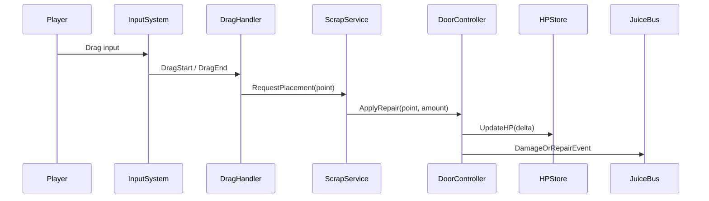

# [FEAT-NNN] Technical Design

**Author:** Kendra Brooks (`performance-hardener`)
**Date:** YYYY-MM-DD
**Linked Story:** RPM-NNN
**Linked ADRs:** ADR-NNN, ADR-MMM
**Status:** Draft | Reviewed | Accepted | Superseded

## Summary
<2–3 sentences. What gets built and why — in engineering terms.>

## Components Changed / Added
| Module (asmdef) | Responsibility | Public API surface |
|---|---|---|
| `Rpm.Gameplay.Door` | Door HP state, damage events | `IDoor`, `DoorController` |
| | | |

## Data Model
- **Types:** <C# types added/changed>
- **Ownership:** <who creates, who mutates, who persists>
- **Persistence:** <ScriptableObject / PlayFab player data / save service>

## Interaction / Sequence
<Use Mermaid. Example:>

## Performance Budget
| Metric | Target | Measured |
|---|---|---|
| Frame time (worst-case frame) | <x ms | |
| GC alloc / frame | 0 bytes hot path | |
| Memory delta | <x MB | |
| Draw calls delta | <x | |
| Startup time impact | <x ms | |

## Failure Modes
| Failure | Behavior | Recovery |
|---|---|---|
| Network drops mid-action | | |
| Save corrupt | | |
| Storage full | | |
| Device suspended | | |

## Testing Approach
- **Unit tests (EditMode):** <what gets unit tested>
- **Integration tests (PlayMode):** <what flows get tested>
- **Device-matrix scenarios:** <references TP-RPM-NNN>
- **Perf capture:** <where + how>

## Rollback Plan
<If shipped and broken, how do we disable or revert? Feature flag? Hotfix path? Server-side kill switch?>

## Open Questions
- <question> — owner, deadline

## Amendments
| Version | Date | Change |
|---|---|---|
| 1.0 | | |
